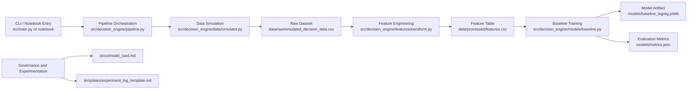
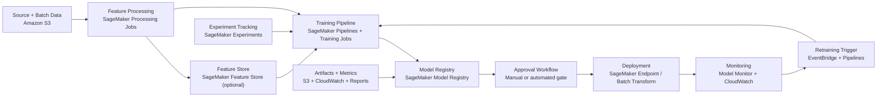

# ML Decision Engine

A clean, end-to-end machine learning system for decision intelligence using simulated real-world data.

[](.github/workflows/ci.yml)

## Executive Summary

This repository is designed as a portfolio-grade ML systems project. It emphasizes the engineering discipline expected in production ML teams: modular architecture, reproducibility, testing, and lightweight governance.

**What reviewers should notice quickly:**

* End-to-end ML workflow with explicit data simulation, feature engineering, training, and artifact outputs
* Reusable package-first implementation in `src/decision_engine/`
* Notebook as a consumer layer, not an implementation layer
* Baseline model + validation + documentation artifacts (`model_card`, experiment template)

## Scope

This project demonstrates how to:

* Build structured datasets from multiple signals
* Engineer features for predictive modeling
* Train and evaluate a baseline classification model
* Simulate decision-making workflows in a reproducible way

## Structure

* `data/` – simulated datasets
* `src/decision_engine/` – modular, reusable ML package
* `notebooks/` – EDA and modeling
* `models/` – saved artifacts
* `docs/` – model governance artifacts
* `templates/` – reusable experiment logging templates
* `sagemaker/` – optional SageMaker job entrypoints only (no AWS SDK in `requirements.txt`)

## Goal

Show a production-style approach to building ML systems — not just notebooks.

## Engineering Highlights

* Clear separation of concerns (simulation, features, model, IO, pipeline orchestration)
* Reusable Python package under `src/decision_engine/`
* Thin notebook layer that consumes package functions instead of embedding core logic
* Configurable command-line entrypoint for reproducible runs
* Basic test suite for feature and pipeline validation

## Architecture



Core orchestration is centralized in `src/decision_engine/pipeline.py`.

## AWS SageMaker Architecture (Production Pattern)



**How this repo maps to SageMaker components**

* `src/decision_engine/data/simulator.py` -> processing job input generation prototype
* `src/decision_engine/features/transform.py` -> feature transformation step in Processing/Pipelines
* `src/decision_engine/models/baseline.py` -> training script entry for SageMaker Training Jobs
* `docs/model_card.md` -> model governance input for approval in Model Registry
* `templates/experiment_log_template.md` -> experiment traceability aligned with SageMaker Experiments

## Quickstart

```bash
make setup
make run
make check
```

Or run directly:

```bash
source .venv/bin/activate
python src/main.py --n-users 3000 --random-state 42 --test-size 0.25
```

Notebook:

```bash
jupyter notebook notebooks/01_decision_engine_baseline.ipynb
```

## Quality and Tooling

```bash
.venv/bin/python -m black src tests sagemaker
.venv/bin/python -m ruff check src tests sagemaker
.venv/bin/python -m pytest -q
```

Configuration lives in `pyproject.toml`.

## Reproducibility

* Deterministic simulation and train/test split via `random_state`
* All outputs are generated from code (no hidden manual data steps)
* Single command execution path through `src/main.py` and `make run`
* Experiment capture template provided at `templates/experiment_log_template.md`

## Environment

* Recommended Python: `3.10+`
* Install dependencies from `requirements.txt`
* CI runs on Ubuntu with Python `3.10`

## Limitations

* Dataset is synthetic and intended for demonstration, not production risk decisions
* Baseline model is scaled logistic regression by design; no extensive model selection included
* Fairness, calibration, and drift monitoring are noted in the model card but not fully implemented

## Roadmap

* Add calibration and threshold optimization workflows
* Add feature drift checks and retraining criteria
* Add model comparison framework (tree ensembles vs baseline linear model)

## Documentation Artifacts

* Model card: `docs/model_card.md`
* Experiment template: `templates/experiment_log_template.md`
* SageMaker migration guide: `docs/sagemaker_migration.md`
* SageMaker starter scripts: `sagemaker/README.md`


